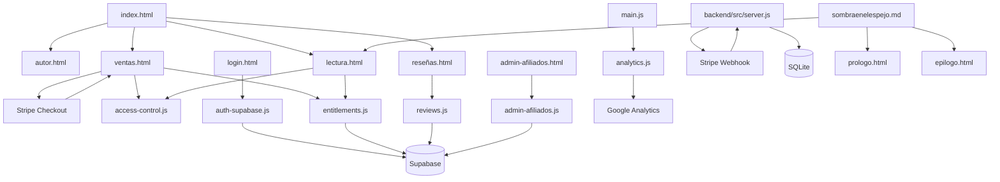

# sombraenelespejo
Sombra en el Espejo recorre la anatomía del control emocional y la dependencia, desde los gestos mínimos que parecen inofensivos hasta el momento en que todo vínculo se convierte en una jaula invisible. A través de personajes complejos y escenas de tensión contenida, el libro propone una lectura cruda pero necesaria sobre los límites del amor, la percepción y la dignidad personal.

"No fue un grito lo que rompió el espejo; fue la costumbre de hablar en voz baja."

## Version actual

- v0.1.3

## Arquitectura y despliegue actual

Este proyecto se despliega como frontend estatico en GitHub Pages, pero se apoya en servicios externos para funciones de negocio.

### Que es estatico y que no

- Frontend estatico: HTML, CSS, JS y contenido Markdown servidos desde GitHub Pages.
- Pasarela de pago externa: Stripe Checkout.
- Autenticacion y datos: Supabase (login, entitlements, reseñas, afiliados).
- Analitica: Google Analytics (gtag).
- Backend opcional/independiente: `backend/` para webhook de Stripe y registro de compras.

### Implicacion real

GitHub Pages sirve bien el sitio, pero el producto completo depende de credenciales y configuracion de Stripe, Supabase y Google. Por tanto, no es un sitio puramente estatico en comportamiento.

### Flujo de compra

1. En Stripe, configura la redireccion despues de pago exitoso a:
   - `https://rubsrueda.github.io/sombraenelespejo/ventas.html?checkout=success`
2. Al volver a [ventas.html](ventas.html), se activa el acceso en el navegador actual.
3. [lectura.html](lectura.html) detecta ese acceso y desbloquea el contenido completo.

### Alcance del acceso por compra actual

- El grant local se puede activar al volver desde checkout en el navegador actual.
- Si hay sesion activa, tambien se intenta persistir entitlement remoto en Supabase.
- El acceso local no sustituye la capa de datos remota para reseñas, afiliados o historico.

## Mapa del sitio

### Flujo principal (usuario)

1. `index.html` - Portada y entrada principal.
2. `autor.html` - Presentacion del autor.
3. `ventas.html` - Compra y activacion de acceso.
4. `lectura.html` - Lectura con desbloqueo por compra.
5. `reseñas.html` - Reseñas y valoraciones.

### Contenido editorial

- `prologo.html` - Vista dedicada al prologo.
- `epilogo.html` - Vista dedicada al epilogo.
- `resumen.html` - Resumen/vision general de la obra.
- `sombraenelespejo.md` - Fuente principal del contenido del libro.

### Acceso y autenticacion

- `login.html` + `login.js` - Inicio de sesion.
- `auth-supabase.js` - Integracion de autenticacion con Supabase.
- `access-control.js` - Grants locales de acceso por compra.
- `entitlements.js` - Persistencia de derechos de acceso.

### Compra y producto

- `producto-config.js` - Catalogo, precios y token/grant del producto.
- `ventas-producto.js` - Render de la pagina de compra y captura del retorno de checkout.

### Panel interno

- `admin-afiliados.html` + `admin-afiliados.js` - Gestion de afiliados.
- `admin-config.js` - Configuracion de panel/admin.

### Infraestructura frontend

- `main.js` - Navegacion comun, menu movil y comportamiento global.
- `i18n-init.js` + `i18n.js` - Internacionalizacion.
- `style.css` - Estilos base del proyecto.
- `tailwind.css` - Utilidades compiladas de Tailwind para produccion.

### SEO y metadatos

- `sitemap.xml` - Mapa XML para buscadores.
- `robots.txt` - Reglas de rastreo.

### Backend (API / datos)

- `backend/src/server.js` - Servidor API.
- `backend/src/db.js` - Conexion/capa de datos.
- `backend/data/` - Datos auxiliares.
- `af_esquema_supabase.sql` y `af_reviews.sql` - Esquemas/queries SQL.

### Diagrama visual (flujo y dependencias)

## Build de estilos (Tailwind en produccion)

El sitio ya no usa `cdn.tailwindcss.com` en produccion.

Comandos utiles:

1. `npm install`
2. `npm run build:css`
3. `npm run build` (frontend + backend en un solo comando)

Archivos de build:

- `tailwind.input.css`
- `tailwind.config.js`
- `tailwind.css`

